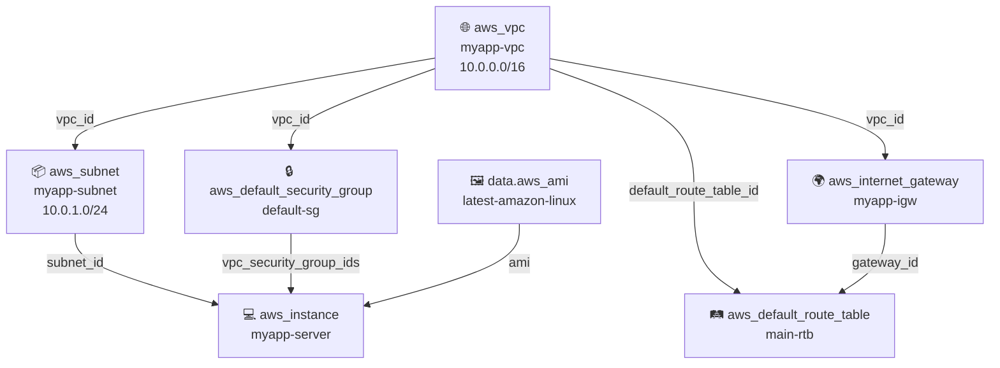
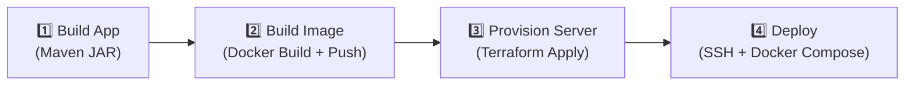

# 🚀 Java Maven App — Full CI/CD Pipeline with Jenkins, Terraform & AWS

> **Course**: TechWorld with Nana — Terraform Module
> **Branch**: `feature/terraform-jenkins-project`

A **complete end-to-end CI/CD pipeline** that builds a Java Spring Boot application, packages it as a Docker image, provisions AWS infrastructure with Terraform, and deploys the containerized app to an EC2 instance — **all orchestrated by Jenkins**.

---

## 📑 Table of Contents

- [High-Level Architecture](#-high-level-architecture)
- [How the Pipeline Works (Step by Step)](#-how-the-pipeline-works-step-by-step)
- [Project Structure](#-project-structure)
- [AWS Infrastructure (Terraform)](#-aws-infrastructure-terraform)
  - [Resources Created](#resources-created)
  - [Network Flow Diagram](#network-flow-diagram)
  - [How Resources Connect to Each Other](#how-resources-connect-to-each-other)
  - [Variables Reference](#variables-reference)
  - [State Management](#state-management)
- [Application Stack](#-application-stack)
- [Docker Setup](#-docker-setup)
- [Jenkins Pipeline Stages](#-jenkins-pipeline-stages)
- [Credentials & Secrets Required](#-credentials--secrets-required)
- [Deployment Flow on the EC2 Instance](#-deployment-flow-on-the-ec2-instance)
- [How to Run Manually](#-how-to-run-manually)
- [Key Ports](#-key-ports)
- [Common Gotchas & Tips](#-common-gotchas--tips)

---

## 🏗 High-Level Architecture

```
┌─────────────────────────────────────────────────────────────────────────────┐
│                              JENKINS SERVER                                │
│                                                                            │
│  ┌──────────┐   ┌──────────────┐   ┌───────────────┐   ┌───────────────┐  │
│  │ Build JAR│──▶│ Build & Push │──▶│  Terraform    │──▶│ Deploy via    │  │
│  │ (Maven)  │   │ Docker Image │   │  Apply (AWS)  │   │ SSH + SCP     │  │
│  └──────────┘   └──────┬───────┘   └───────┬───────┘   └───────┬───────┘  │
│                         │                   │                   │          │
└─────────────────────────┼───────────────────┼───────────────────┼──────────┘
                          │                   │                   │
                          ▼                   ▼                   ▼
                   ┌─────────────┐    ┌──────────────┐   ┌──────────────────┐
                   │  DockerHub  │    │  AWS Cloud   │   │  EC2 Instance    │
                   │  Registry   │    │  (VPC, EC2,  │   │  ┌────────────┐  │
                   │             │    │   SG, IGW)   │   │  │ Java App   │  │
                   └─────────────┘    └──────────────┘   │  │ :8080      │  │
                                                         │  ├────────────┤  │
                                                         │  │ PostgreSQL │  │
                                                         │  │ :5432      │  │
                                                         │  └────────────┘  │
                                                         └──────────────────┘
```

---

## 🔄 How the Pipeline Works (Step by Step)

| #  | Stage                | What Happens                                                                                         |
|----|----------------------|------------------------------------------------------------------------------------------------------|
| 1  | **Build App**        | Maven compiles the Java source code and produces `java-maven-app-1.0-SNAPSHOT.jar`                   |
| 2  | **Build Image**      | Docker builds an image from the JAR, tags it `omar1015/java-maven-app:java-maven-2.0`, pushes to DockerHub |
| 3  | **Provision Server** | Terraform creates a full VPC + subnet + security group + EC2 instance in `us-east-1`                |
| 4  | **Wait**             | Pipeline sleeps **120 seconds** for the EC2 instance to finish booting and user-data script          |
| 5  | **Deploy**           | Jenkins SCPs `server-cmds.sh` + `docker-compose.yaml` to EC2, then SSHs in to run them              |
| 6  | **App Running**      | `docker-compose up` pulls the image from DockerHub, starts the Java app + PostgreSQL on the EC2      |

---

## 📁 Project Structure

```
.
├── Jenkinsfile                 # 🔵 CI/CD pipeline definition (4 stages)
├── Dockerfile                  # 🐳 Packages the JAR into a Docker image
├── docker-compose.yaml         # 🐳 Runs Java app + PostgreSQL together
├── pom.xml                     # ☕ Maven build config (Spring Boot 3.5.5, JDK 17)
├── server-cmds.sh              # 📜 Runs on EC2: docker login + compose up
├── terraform.tfvars            # 📝 Variable overrides (VPC/subnet CIDRs)
├── src/
│   └── main/
│       ├── java/               # ☕ Spring Boot application source code
│       └── resources/          # ⚙️ Application configuration files
└── terraform/
    ├── main.tf                 # 🏗️ ALL infrastructure: VPC, Subnet, IGW, SG, EC2
    ├── variables.tf            # 📋 Input variable declarations with defaults
    └── entry-script.sh         # 📜 EC2 user-data: installs Docker & Docker Compose
```

---

## ☁️ AWS Infrastructure (Terraform)

### Resources Created

| #  | Resource Type                      | Logical Name              | Purpose                                             |
|----|------------------------------------|---------------------------|-----------------------------------------------------|
| 1  | `aws_vpc`                          | `myapp-vpc`               | Isolated network — CIDR `10.0.0.0/16`               |
| 2  | `aws_subnet`                       | `myapp-subnet`            | Single public subnet — CIDR `10.0.1.0/24`           |
| 3  | `aws_internet_gateway`             | `myapp-igw`               | Enables internet access for the VPC                  |
| 4  | `aws_default_route_table`          | `main-rtb`                | Routes all traffic (`0.0.0.0/0`) through the IGW     |
| 5  | `aws_default_security_group`       | `default-sg`              | Firewall rules: allow SSH (22), HTTP (8080), all egress |
| 6  | `aws_instance`                     | `myapp-server`            | EC2 instance running Docker + app containers         |
| 7  | `data.aws_ami`                     | `latest-amazon-linux`     | Dynamically fetches latest Amazon Linux 2023 AMI     |

### Network Flow Diagram

```
                         INTERNET
                            │
                            ▼
                 ┌─────────────────────┐
                 │  Internet Gateway   │
                 │  (myapp-igw)        │
                 └─────────┬───────────┘
                           │
                 ┌─────────▼───────────┐
                 │  Route Table        │
                 │  (main-rtb)         │
                 │  0.0.0.0/0 → IGW   │
                 └─────────┬───────────┘
                           │
            ┌──────────────▼──────────────────┐
            │     VPC: 10.0.0.0/16            │
            │     (myapp-vpc)                 │
            │                                 │
            │  ┌────────────────────────────┐  │
            │  │  Subnet: 10.0.1.0/24      │  │
            │  │  (myapp-subnet)           │  │
            │  │  AZ: us-east-1a           │  │
            │  │                           │  │
            │  │  ┌──────────────────────┐ │  │
            │  │  │  EC2 Instance        │ │  │
            │  │  │  (myapp-server)      │ │  │
            │  │  │                      │ │  │
            │  │  │  ┌──────┐ ┌───────┐  │ │  │
            │  │  │  │ App  │ │Postgre│  │ │  │
            │  │  │  │:8080 │ │:5432  │  │ │  │
            │  │  │  └──────┘ └───────┘  │ │  │
            │  │  └──────────────────────┘ │  │
            │  └────────────────────────────┘  │
            └──────────────────────────────────┘
```

### How Resources Connect to Each Other

This is the **dependency chain** — each resource references another, and Terraform builds them in the correct order:



**In plain English:**

1. **VPC** is the root — everything lives inside it.
2. **Subnet** is created inside the VPC (`vpc_id = aws_vpc.myapp-vpc.id`).
3. **Internet Gateway** is attached to the VPC to allow internet traffic.
4. **Route Table** uses the VPC's default route table and adds a route `0.0.0.0/0 → IGW` so instances can reach the internet.
5. **Security Group** is the VPC's default SG, customized with inbound rules for SSH (22) and the app (8080), plus full outbound access.
6. **AMI Data Source** queries AWS for the latest Amazon Linux 2023 image — no hardcoded AMI ID needed.
7. **EC2 Instance** ties it all together:
   - Placed in `myapp-subnet`
   - Protected by `default-sg`
   - Uses the dynamically-fetched AMI
   - Gets a **public IP** (`associate_public_ip_address = true`)
   - Runs `entry-script.sh` as **user-data** on first boot (installs Docker + Docker Compose)
   - Uses SSH key pair `myapp-key-pair` (must be pre-created in AWS Console)

### Variables Reference

| Variable              | Default Value         | Description                              |
|-----------------------|-----------------------|------------------------------------------|
| `vpc-cidr-block`      | `10.0.0.0/16`        | CIDR block for the VPC (65,536 IPs)      |
| `subnet-cidr-block`   | `10.0.1.0/24`        | CIDR block for the subnet (256 IPs)      |
| `availability-zone`   | `us-east-1a`         | AZ where the subnet & EC2 are placed     |
| `env-prefix`          | `dev`                | Prefix for all resource Name tags         |
| `my-ip`               | `197.46.229.191/32`  | Your IP for SSH access (defined but not used in SG — SG uses `0.0.0.0/0`) |
| `instance_type`       | `t3.micro`           | EC2 instance size                         |
| `region`              | `us-east-1`          | AWS region for all resources              |

> **📝 Note:** The `terraform.tfvars` in the project root contains **additional** CIDR variables (`private_subnet-cidr-block`, `public-subnet-cidr-block`) that suggest a multi-subnet expansion is planned but not yet used in `main.tf`.

### State Management

```
Backend: S3
├── Bucket:  omars-tf-state-bucket
├── Key:     terraform.tfstate
└── Region:  us-east-1
```

> **⚠️ Important:** The S3 bucket `omars-tf-state-bucket` must exist **before** running `terraform init`. Create it manually or with a separate Terraform config. Never store state locally in a team environment.

---

## ☕ Application Stack

| Component       | Technology             | Version       |
|-----------------|------------------------|---------------|
| Language        | Java                   | 17            |
| Framework       | Spring Boot            | 3.5.5         |
| Build Tool      | Maven                  | 3.9 (Jenkins) |
| Logging         | Logstash Logback Encoder | 9.0         |
| Testing         | JUnit                  | 4.13.2        |
| Database        | PostgreSQL             | 16            |

The Maven build produces: `target/java-maven-app-1.0-SNAPSHOT.jar`

---

## 🐳 Docker Setup

### Dockerfile

```dockerfile
FROM amazoncorretto:17-alpine-jdk    # Amazon's JDK 17 (lightweight Alpine)
EXPOSE 8080                          # App listens on port 8080
COPY ./target/java-maven-app-*.jar /usr/app/
WORKDIR /usr/app
ENTRYPOINT ["java", "-jar", "java-maven-app-1.0-SNAPSHOT.jar"]
```

### Docker Compose (runs on EC2)

| Service          | Image                                      | Port Mapping |
|------------------|--------------------------------------------|--------------|
| `java-maven-app` | `omar1015/java-maven-app:java-maven-2.0`  | `8080:8080`  |
| `postgres`       | `postgres:16`                              | `5432:5432`  |

> **🔴 Warning:** The PostgreSQL password is hardcoded as `my-pwd` in `docker-compose.yaml`. For production, use Docker secrets or environment variables from a secure store.

---

## 🔵 Jenkins Pipeline Stages



### Stage Details

#### Stage 1 — Build App
- Uses Jenkins shared library function `buildJar()` from [Omars105/Jenkins-shared-library](https://github.com/Omars105/Jenkins-shared-library.git) (branch `jenkins-shared-lib-terrafrom-project`)
- Runs `mvn package` under the hood

#### Stage 2 — Build Image
- Calls shared library functions: `buildImage()`, `dockerLogin()`, `dockerPush()`
- Pushes to DockerHub as `omar1015/java-maven-app:java-maven-2.0`

#### Stage 3 — Provision Server
- Changes directory to `terraform/`
- Runs `terraform init -force-copy` (handles backend migration if needed)
- Runs `terraform apply --auto-approve` (no manual confirmation)
- Captures the EC2 public IP via `terraform output -raw ec2-public-ip`
- AWS credentials are injected from Jenkins credentials store

#### Stage 4 — Deploy
- Waits **120 seconds** for the EC2 to fully initialize
- SCPs two files to the EC2 instance:
  - `server-cmds.sh` — login to Docker + compose up
  - `docker-compose.yaml` — service definitions
- SSHs into EC2 and runs: `bash ./server-cmds.sh <IMAGE> <DOCKER_USER> <DOCKER_PWD>`

---

## 🔐 Credentials & Secrets Required

These must be configured in **Jenkins Credentials Store** before running the pipeline:

| Credential ID                       | Type                  | Used In                   | Purpose                              |
|-------------------------------------|-----------------------|---------------------------|--------------------------------------|
| `Github-jenkins-pat`                | Username/Password     | Shared Library            | Access to Jenkins shared library repo |
| `jenkins_aws_access_key_id`         | Secret Text           | Stage 3 (Provision)       | AWS Access Key for Terraform          |
| `jenkins-aws_secret_access_key_id`  | Secret Text           | Stage 3 (Provision)       | AWS Secret Key for Terraform          |
| `omar-dockerhub-repo`              | Username/Password     | Stage 4 (Deploy)          | DockerHub login for pulling images    |
| `server-ssh-key`                   | SSH Username with Key | Stage 4 (Deploy)          | SSH key to connect to EC2 instance    |

> **🔴 Caution:** The SSH key pair `myapp-key-pair` referenced in `main.tf` must be created in the **AWS Console** (EC2 → Key Pairs) before Terraform runs. The private key should be added to Jenkins as the `server-ssh-key` credential.

---

## 📜 Deployment Flow on the EC2 Instance

When the EC2 instance boots for the first time, the **user-data** script (`entry-script.sh`) runs automatically:

```
EC2 Boot Sequence:
┌──────────────────────────────────────────┐
│ 1. yum update -y                         │
│ 2. yum install -y docker                 │
│ 3. systemctl start docker                │
│ 4. systemctl enable docker               │
│ 5. usermod -aG docker ec2-user           │
│ 6. Download docker-compose v2.3.3        │
│ 7. chmod +x docker-compose               │
└──────────────────────────────────────────┘
         ⏳ ~120 seconds later...
┌──────────────────────────────────────────┐
│ Jenkins SSHs in and runs server-cmds.sh: │
│ 1. docker login (with DockerHub creds)   │
│ 2. docker-compose down (cleanup old)     │
│ 3. docker-compose up --detach            │
│    ├── java-maven-app → :8080            │
│    └── postgres:16    → :5432            │
└──────────────────────────────────────────┘
```

---

## 🛠 How to Run Manually

### Prerequisites
- AWS CLI configured with valid credentials
- Terraform ≥ 1.2.0 installed
- S3 bucket `omars-tf-state-bucket` already created
- Key pair `myapp-key-pair` created in AWS Console (us-east-1)

### Provision Infrastructure
```bash
cd terraform/
terraform init
terraform plan          # Review what will be created
terraform apply         # Type 'yes' to confirm
```

### Get the EC2 Public IP
```bash
terraform output ec2-public-ip
```

### SSH into the Instance
```bash
ssh -i /path/to/myapp-key-pair.pem ec2-user@<EC2_PUBLIC_IP>
```

### Deploy Manually (on the EC2)
```bash
# Copy files to EC2
scp -i /path/to/myapp-key-pair.pem server-cmds.sh docker-compose.yaml ec2-user@<EC2_PUBLIC_IP>:/home/ec2-user

# SSH and deploy
ssh -i /path/to/myapp-key-pair.pem ec2-user@<EC2_PUBLIC_IP>
bash ./server-cmds.sh omar1015/java-maven-app:java-maven-2.0 <DOCKER_USER> <DOCKER_PWD>
```

### Destroy Everything
```bash
cd terraform/
terraform destroy       # Type 'yes' to confirm
```

---

## 🔌 Key Ports

| Port   | Protocol | Direction | Service              | Accessible From   |
|--------|----------|-----------|----------------------|-------------------|
| `22`   | TCP      | Inbound   | SSH                  | `0.0.0.0/0` (all) |
| `8080` | TCP      | Inbound   | Java Spring Boot App | `0.0.0.0/0` (all) |
| `5432` | TCP      | Internal  | PostgreSQL           | Container network  |
| `*`    | All      | Outbound  | All egress traffic   | `0.0.0.0/0` (all) |

> **💡 Tip:** In production, restrict SSH access to your IP only by changing the security group ingress `cidr_blocks` from `["0.0.0.0/0"]` to `[var.my-ip]`. The variable `my-ip` already exists for this purpose.

---

## ⚠️ Common Gotchas & Tips

| Issue | Explanation | Fix |
|-------|-------------|-----|
| `terraform init` fails | S3 backend bucket doesn't exist | Create `omars-tf-state-bucket` in `us-east-1` first |
| EC2 can't be SSHed into | Key pair not found in AWS | Create `myapp-key-pair` in AWS Console → EC2 → Key Pairs |
| Deploy fails with "connection refused" | EC2 is still running user-data script | The 120-second sleep may not be enough — increase it or add a retry loop |
| Docker permission denied on EC2 | `usermod -aG docker ec2-user` requires re-login | Disconnect and reconnect SSH, or use `newgrp docker` |
| `terraform apply` creates new EC2 every time | `user_data_replace_on_change = true` means any change to `entry-script.sh` destroys and recreates the instance | Only modify the script when you actually want a fresh instance |
| `-force-copy` flag in Jenkinsfile | Forces state migration without prompt (e.g., local → S3) | Safe for CI/CD, but be cautious if switching backends |

---

## 📊 Technology Summary

```
┌────────────────────────────────────────────────────────┐
│                    TOOLS & SERVICES                    │
├──────────────┬─────────────────────────────────────────┤
│ CI/CD        │ Jenkins + Shared Library (Groovy)       │
│ IaC          │ Terraform (HCL) + S3 Backend            │
│ Cloud        │ AWS (VPC, EC2, IGW, SG, Route Table)    │
│ Container    │ Docker + Docker Compose                  │
│ Registry     │ DockerHub (omar1015)                     │
│ App Runtime  │ Java 17 (Amazon Corretto) + Spring Boot │
│ Build        │ Maven 3.9                                │
│ Database     │ PostgreSQL 16                            │
│ OS           │ Amazon Linux 2023                        │
│ SCM          │ Git + GitHub                             │
└──────────────┴─────────────────────────────────────────┘
```

---

> **💡 Remember:** This project demonstrates a complete DevOps workflow — from writing code to running it in the cloud. Every file has a purpose, and they all connect through the Jenkins pipeline. The Terraform code creates the infrastructure, the Docker files package the app, and Jenkins ties everything together automatically.
